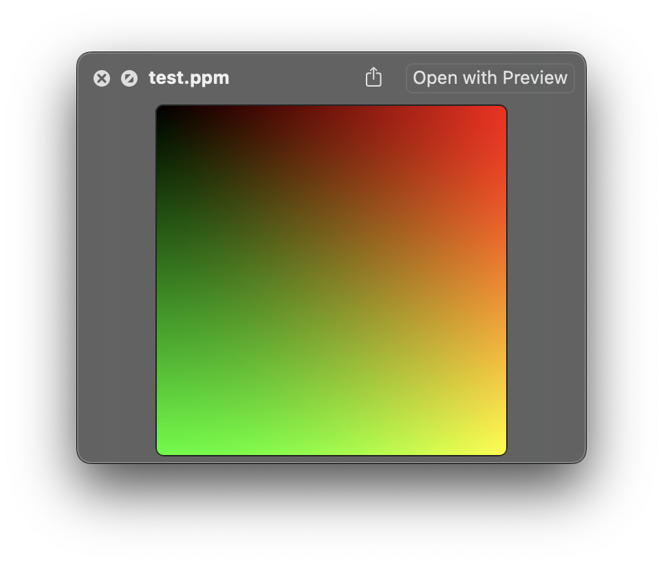

# Ray-Tracing-in-One-Weekend-in-Swift
Raytracer explorations based on the popular series 

I am following the tutorials in [_Ray Tracing in One Weekend_](https://raytracing.github.io/books/RayTracingInOneWeekend.html) but writing the code in Swift for good practice.  
I did a C version here: [Ray-Tracing-in-One-Weekend-in-C](https://github.com/multitudes/Ray-Tracing-in-One-Weekend-in-C)

Swift has been originally deeloped by Apple for iOS and macOS development. However, it is now open source and can be used on Linux and Windows. What is missing from Swift when used on Linux are the Apple frameworks, especially the foundation frameworks which are like the `stdlib` in C are different on Linux and macOS.  
As an experiment I would like to keep this repo cross platform and see how far I can get! 

## The set up

If you need to install Swift please see this small guide: [Swift installation](swift.md)

It is possible but now usual to run swift from a makefile. Instead, for this project I will create a swift package.
```bash
swift package init --name inaweekend --type executable
```

it is interesting that like in C, swift will create intermediate files and even a .o file but those will be kept hidden in the .build directory. Actually to execute the program, you can just run `swift run` and it will create the .build directory, compile and run the program.
Or run the main.swift file directly with `swift Sources/main.swift`.  
But where is my executable? It is in the .build directory. You can run it with (in my case) `./.build/arm64-apple-macosx/debug/inaweekend`.  
Interestingly using `swift Sources/main.swift` will not create the executable in the .build directory. In this case swift will act as interpreter and run the code directly!

I do not need to have a file called main.swift. I can rename my file and add `@main` to the struct that contains the main function for the same effect but now my code can use an asynchronous entry point if required.  (NB I cannot use main.swift anymore in this case...)
```swift
@main
struct raytracinginaweekend {
  static func main() {
    print("Hello, world!")
  }
}
```

Enough for the setup. lets start coding.

## Chapter 1
The first chapter is about setting up the project and creating a simple image. The image is a PPM file. The PPM file format is a simple format that can be created by writing a header and then the pixel values. The header is:
```
P3
256 256
255
```
It means: p3 (magic number), 256x256 pixels, 255 is the maximum value for the pixel values. The pixel values are written in ASCII format. The pixel values are written in rows from left to right and from top to bottom. Each pixel is written as three values for the red, green and blue components. Each value is between 0 and 255. The values are separated by spaces and each row is terminated by a newline character.
As easy as it gets for a image file format!

Swift is a safe language. To write to a file the string is converted to data in the correct `.utf8` encoding and then written to a file. Since the encoding could fail, the output is an optional type and needs to be either checked with an if let guard condition or unwrapped with a `!` operator. Ex this is ok but not great, my program would crash if the encoding fails:
```swift
		let pixel: String = "\(ir) \(ig) \(ib)\n"
		fileHandle.write(pixel.data(using: .utf8)!)
```
This is better, it will not crash but it will not write to the file either:
```swift
		let pixel: String = "\(ir) \(ig) \(ib)\n"
		if let data = pixel.data(using: .utf8) {
			fileHandle.write(data)
		}
```
It is debatable. I think in debug mode I would like my program to crash if the encoding fails. In production I would like to handle the error.  
For sure the Swift purists will get very upset to see an exclamation mark in my code so I will use the latter :)

The code looks like this:
```swift
@main
struct raytracinginaweekend {
  static func main() {
    let image_width: Int = 256;
    let image_height: Int = 256;
	let fileName: String = "test.ppm"
	let filePath: String = FileManager.default.currentDirectoryPath + "/" + fileName
	
	FileManager.default.createFile(atPath: filePath, contents: nil, attributes: nil)
	
	if let fileHandle: FileHandle = FileHandle(forWritingAtPath: filePath) {
		let header: String = "P3\n\(image_width) \(image_height)\n255\n"
		if let headerData: Data = header.data(using: .utf8) {
			fileHandle.write(headerData)
		}
		for j in 0..<image_height {
			for i in 0..<image_width {
				let r: Double = Double(i) / Double(image_width-1)
				let g: Double = Double(j) / Double(image_height-1)
				let b: Double = 0.0

				let ir: Int = Int(255.999 * r)
				let ig: Int = Int(255.999 * g)
				let ib: Int = Int(255.999 * b)

				let pixel: String = "\(ir) \(ig) \(ib)\n"
				if let pixel: Data = pixel.data(using: .utf8) {
					fileHandle.write(pixel)
				}
			}
		}
		fileHandle.closeFile()
	}
  }
}
```
This is the result:
<div style="text-align: center;">

</div>

## Creating a vector struct
In Swift we tend to use structs instead of classes. They are cheap and passed by value.
I will create an array for the components, maybe the peformance is better?
Then I have two initializers and the getters for clarity.
```swift
struct Vec3 {

	var e: [Double]

	init(x: Double, y: Double, z: Double) {
		e = [x, y, z]
	}

	init() {
		e = [0.0, 0.0, 0.0]
	}

	func x() -> Double {
		return e[0]
	}
	...
}
```
Struct in Swift are not mutable by default.  
Operator overloading is not a problem.  Here is how it is done. The `inout` keyword 
is used to pass the parameters by reference. 

```swift
extension Vec3 {
	static func + (left: Vec3, right: Vec3) -> Vec3 {
       return Vec3(x: left.x() + right.x(), y: left.y() + right.y(), z: left.z() + right.z())
    }

	static func += (left: inout Vec3, right: Vec3) {
        left = left + right
    }
}
```


## Links
https://metalkit.org/ray-tracing-in-a-swift-playground/  
https://metalkit.org/ray-tracing-in-a-swift-playground-part-5/  

- A great youtube series https://www.youtube.com/playlist?list=PLlrATfBNZ98edc5GshdBtREv5asFW3yXl  


